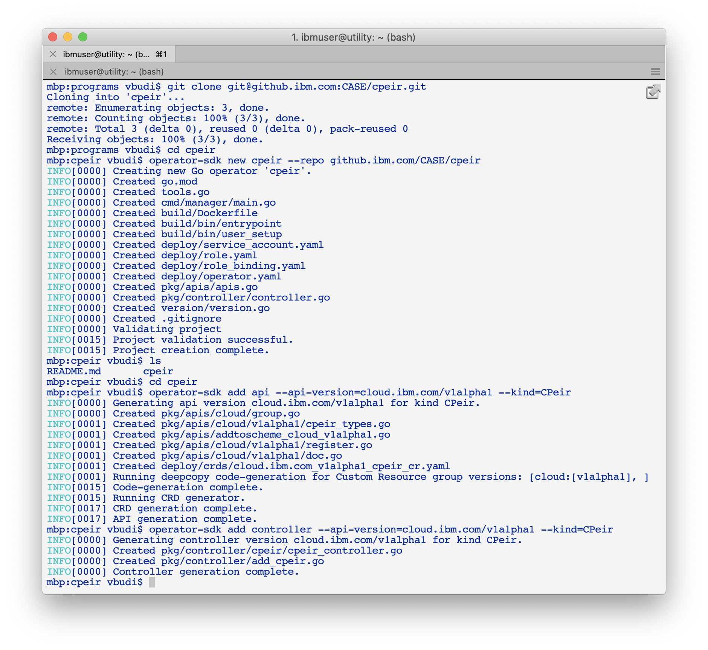

# Cloud Pak cpeir

## Requirements

- [git](https://git-scm.com/downloads)
- [go](https://golang.org/dl/) version v1.13+.
- [mercurial](https://www.mercurial-scm.org/downloads) version 3.9+
- docker version 17.03+ or podman v1.2.0+ or buildah v1.7+
- kubectl version v1.12.0+ or oc version 4.2+
- operator-sdk `brew install operator-sdk`
- Access to a Kubernetes v1.12.0+ cluster.

## Creation

This repository is created this way:

1. Create a git repo and clone it; change to the git path

	```
	git clone git@github.ibm.com:CASE/cpeir.git
	cd cpeir
	```

2.  Create a new operator:

	```
	operator-sdk new cpeir --repo github.ibm.com/CASE/cpeir
	```

3. Create the API and controller:

	```
	cd cpeir
	operator-sdk add api --api-version=cloud.ibm.com/v1alpha1 --kind=CPeir
	operator-sdk add controller --api-version=cloud.ibm.com/v1alpha1 --kind=CPeir
	```

	

4. Modify the API part (the Custom Resource object definition)

	```
	vi pkg/apis/cloud/v1alpha1/cpeir_types.go
	```

	**Note**:
	- The path cloud/v1alpha1 is from the api-version definition
	- The objecct structure that must be modified are `CPeirSpec` and `CPeirStatus`
	- Spec represents things that you define (yaml input), Status represents things that the system observes (result from the operator)

	```go
	// CPeirSpec defines the desired state of CPeir
	type CPeirSpec struct {
	        // +kubebuilder:validation:Enum=cp4application;cp4integration;cp4automation;cp4multicloud
	        CPType string `json:"cptype"`
	        CPVersion string `json:"cpversion"`
	        CPFeatures []string `json:"cpfeatures"`
	}

	// CPeirStatus defines the observed state of CPeir
	type CPeirStatus struct {
	        // +kubebuilder:validation:Enum=Initial;NotInstallable;ReadyToInstall;Installed;ValidationFailed;UpgradeAvailable
	        ClusterStatus string `json:"clusterStatus"`
	        StatusMessages string `json:"statusMessages"`
	        InstalledFeatures []string `json:"installedFeatures"`
	}
	```
5. Generate kubernetes definition

	```
	operator-sdk generate k8s
	```

6. Modify CRD definition in-accordance with the API definition:

	```
	operator-sdk generate crds
	vi deploy/crds/cloud.ibm.com_cpeir_crd.yaml
	```

	```yaml
	        spec:
	          description: CPeirSpec defines the desired state of CPeir
	          required: ["cptype", "cpversion"]
	          properties:
	            cptype:
	              type: "string"
	              enum:
	              - cp4application
	              - cp4integration
	              - cp4automation
	              - cp4multicloud
	            cpversion:
	              type: "string"
	            cpfeatures:
	              type: "array"
	              items:
	                type: "string"
	          type: object
	        status:
	          description: CPeirStatus defines the observed state of CPeir
	          properties:
	            installedFeatures:
	              type: "array"
	              items:
	                type: "string"
	            clusterStatus:
	              type: "string"
	              enum:
	              - Initial
	              - NotInstallable
	              - ReadyToInstall
	              - Installed
	              - ValidationFailed
	              - UpgradeAvailable
	            statusMessages:
	              type: "string"
	          type: object
	      type: object
	```
7. Modify the CR sample object:

	```
	vi deploy/crds/cloud.ibm.com_v1alpha1_cpeir_cr.yaml
	```

	```yaml
	apiVersion: cloud.ibm.com/v1alpha1
	kind: CPeir
	metadata:
	  name: cp4application
	spec:
	  cptype: "cp4application"
	  cpversion: "4.0.1"
	```
	
8. Modify the controller program:

	```
	vi pkg/controller/cpeir/cpeir_controller.go
	```

	The current controller program creates a pod with the busybox which sleep for an hour.
	**TODO**: More must be done here

	**TODO**: modify `deploy/role.yaml` to add more authority to inspect nodes


## When you are done 

1. Build your operator image:

	```
	operator-sdk build ibmcloudacademy/cpeir:v0.0.1
	```

2. Push up the image to a docker repository

	```
	docker push ibmcloudacademy/cpeir:v0.0.1
	```

3. Create OpenShift resources:

	```
	oc create -f deploy/crds/cloud.ibm.com_cpeirs_crd.yaml
	oc create -f deploy/service_account.yaml
	oc create -f deploy/role.yaml
	oc create -f deploy/role_binding.yaml
	```

4. Modify the operator.yaml with the image you push to docker repo

	```
	oc create -f deploy/operator.yaml
	```

5. Create the Custom object and test:

	```
	oc create -f deploy/crds/cloud.ibm.com_v1alpha1_cpeir_cr.yaml
	```


