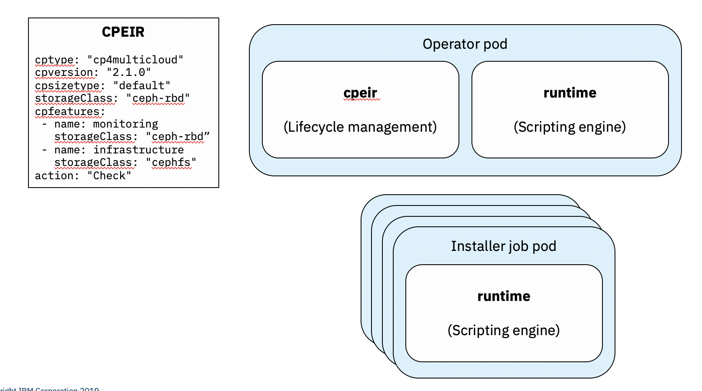

# Cloud Pak LifeCycle Operator - cpeir project

## Overview

The IBM Cloud Pak lifecycle management operator will run as native extension to Kuberentes (OpenShift) to provide insight and manage IBM Cloud Pak components.
This operator will:

  - manage a Cloud Pak deployment
  - check for requisite resource requirements
  - verify the installation
  - do stability check
  - check for updates

For information on implementing this operator, see [installation](installation.md).

## Runtime Configuration

The main processing is performed in the operator pod. The pod is structured as follows:



The Custom Resource is called CPEIR and has all the installation specification, and it is managed by the operator pod.

## Module Development

The scripts related to this project is stored in <cpeir-files> project.

All the file names in this project are in the format of:

- `<cloudpak>-<version>.[yaml|sh]`
- `<cloudpak>-<version>-<feature>.[yaml|sh]`

The project folders are:

- config: main folder containing the yaml files for cloudpak and its cpu/memory requirements; the crd objects are validated against the configuration here. The format of this yaml is as follows:

    ```yaml
    requirements:
      default:
        cpu: 700m
        memory: 1Gi
        pv: 3Gi
        disk: 0
    ```

- check: scripts for checking whether a certain cloudpak or feature is installed; the standard output is always in the following format:

    ```json
    {"installed": true|false,
     "name": "${name}",
     "version": "${version}",
     "feature": "${feature}"
    }
    ```

- install: scripts for collecting installation information and generate an install job; the scripts generates a job with the name `<cloudpak>-<version>-installation` or `<cloudpak>-<version>-<feature>-installation`

- installjob: scripts to be run by the installation job; this script runs in the same container as the runtime container.
